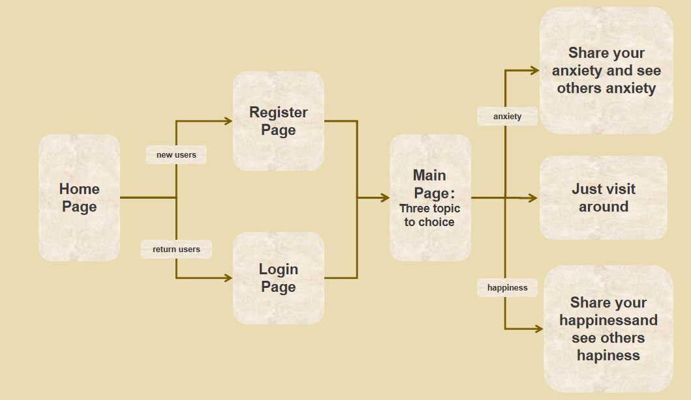

# The Anxiety Time Machine

> See your current worries through the lens of the future.

**Built by Boyi Sun, Ruoyu Wu and Xiaoyue Yu for She Innovates 2026.**

## Inspiration
As college students, we often feel overwhelmed by anxiety—whether it relates to grades, relationships, or financial stability. In the moment, these problems feel insurmountable. However, we realized that these same issues might look completely different to someone who is 30, 60, or 90 years old.

We built **The Anxiety Time Machine** to bridge the gap between generations. Our goal is to provide perspective and relief to anxious minds by showing how priorities and viewpoints shift over a lifetime.

## 📋 What it does

The Anxiety Time Machine is a web-based emotional sharing platform that helps users express and process their feelings while discovering they're not alone in their experiences. The platform provides a safe space for emotional expression through three distinct pathways:

1. **Anxiety Sharing Channel:** A dedicated space where you can write down your current anxieties and worries. After sharing, you'll experience a concise overview of anxiety patterns across different age groups, helping you understand how perspectives on similar concerns evolve throughout life's journey.

2. **Happiness Sharing Channel:** A positive environment where you can celebrate and share your happy moments and achievements. The platform provides insights into happiness patterns across various age groups, revealing how sources of joy and fulfillment shift and transform over time.

3. **Visiting Channel:** A browsing mode that lets you explore without posting. Simply visit around to read others' shared experiences, gain perspective on diverse emotional journeys, and find comfort in the collective human experience—all while maintaining your privacy and observing at your own pace.
The platform transforms personal emotional experiences into a collective narrative, helping users understand that anxiety and happiness are shared human conditions that connect us all.

## ✨ Key Features

### The logic of the application:


### User Features
- **User Registration & Login**: Secure user authentication system
- **Emotional Topic Selection**: Users can choose from three topics:
  - 😰 Anxiety - Share your anxiety and see others' anxiety
  - 😊 Happiness - Share your happy moments and see others' happiness
  - 👀 Just Visit Around - Browse different emotional shares

### Core Pages
- **Home Page**: Application entry point
- **Register Page**: New user registration
- **Login Page**: Returning user login
- **Main Page**: Three topic selection hub
- **Share Anxiety Page**: Share and browse anxiety emotions
- **Share Moments Page**: Share and browse happy moments

## 🗂️ Project Structure

```
THE-ANXIETY-TIME-MACHINE/
├── Database/                    # Database related files
│   ├── Anxiety_Table.xlsx      # Anxiety data table
│   ├── AnxietyvsHappiness_Table.xlsx  # Emotion comparison table
│   ├── DB_create.sql           # Database creation script
│   └── DB_import_data.py       # Data import script
├── public/                      # Static resources
│   └── index.html              # Main HTML file
├── src/                         # Source code
│   ├── components/             # React components
│   │   ├── AnxietyPage.jsx    # Anxiety page component
│   │   ├── BrowsePage.jsx     # Browse page component
│   │   ├── ConfessionPage.jsx # Confession page component
│   │   ├── DashboardPage.jsx  # Dashboard page component
│   │   ├── HomePage.jsx       # Home page component
│   │   ├── LoginPage.jsx      # Login page component
│   │   ├── RegisterPage.jsx   # Register page component
│   │   ├── ShareAnxietyPage.jsx    # Share anxiety page component
│   │   └── ShareMomentsPage.jsx    # Share moments page component
│   ├── data/                   # Data files
│   │   └── mockData.js        # Mock data
│   ├── App.css                 # Application styles
│   ├── App.jsx                 # Main application component
│   └── index.js                # Application entry point
├── app.py                       # Flask backend server
├── package.json                 # Project dependencies
└── README.md                    # Project documentation
```

## 🛠️ Tech Stack

### Frontend
- **React.js** - User interface framework
- **JavaScript/JSX** - Programming language
- **CSS** - Styling

### Backend
- **Python Flask** - Backend framework
- **SQLite/SQL** - Database

### Development Tools
- **Node.js & npm** - Package management
- **Git** - Version control

## 🚀 Quick Start

### Prerequisites
- Node.js (v14.0 or higher)
- Python (v3.7 or higher)
- npm or yarn

### Installation Steps

1. **Clone the repository**
```bash
git clone 
cd THE-ANXIETY-TIME-MACHINE
```

2. **Install frontend dependencies**
```bash
npm install
```

3. **Install Python dependencies**
```bash
pip install flask flask-cors
```

4. **Initialize the database**
```bash
cd Database
python DB_import_data.py
```

5. **Start the backend server**
```bash
python app.py
```

6. **Start the frontend development server**
```bash
npm start
```

7. **Access the application**
Open your browser and navigate to `http://localhost:3000`

##  Database Design

### Main Tables - User Table

- id 
- nickname 
- password 
- age 
- gender 
- tag      
- description 
- message_id -- distinguish btween anxiety message and happiness message
##  User Flow

```
Home Page → Register/Login → Main Page → Select Topic → Share/Browse Emotions
```

1. New users visit the home page and choose to register
2. Returning users login directly
3. After login, enter the main page and select one of three topics
4. Share your emotions or browse others' shares on the corresponding topic page


## Challenges we ran into


## What's next for The Anxiety Time Machine


---

