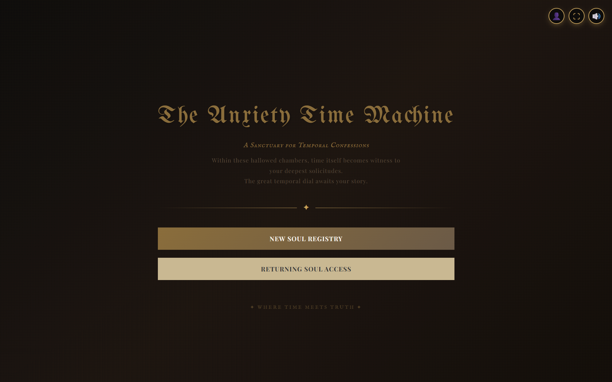
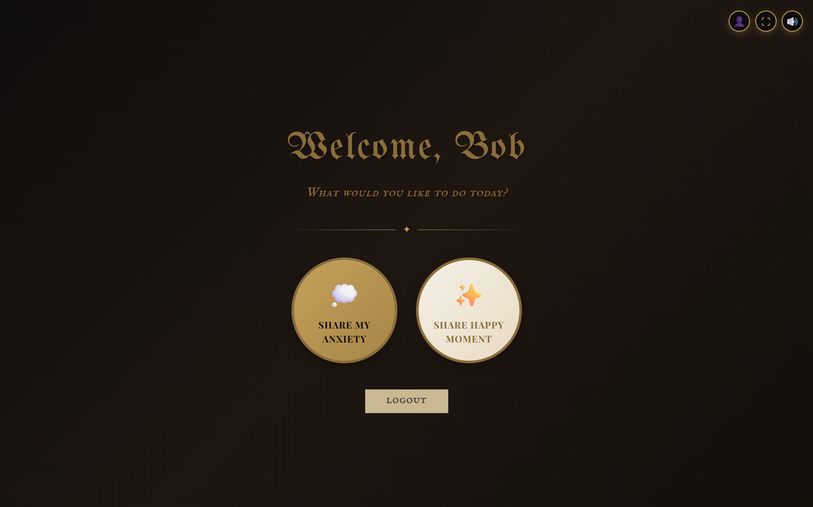
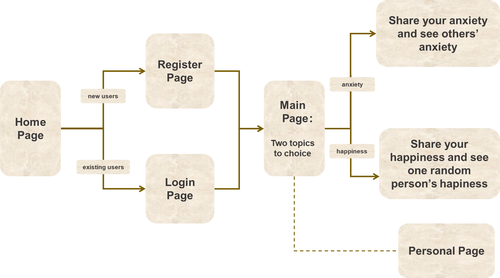

# The Anxiety Time Machine

> See your current worries through the lens of the future.

**Built by Boyi Sun, Ruoyu Wu and Xiaoyue Yu for She Innovates 2026.**

## Inspiration
As college students, we often feel overwhelmed by anxiety—whether it relates to grades, relationships, or financial stability. In the moment, these problems feel insurmountable. However, we realized that these same issues might look completely different to someone who is 30, 60, or 90 years old.

We built **The Anxiety Time Machine** to bridge the gap between generations. Our goal is to provide perspective and relief to anxious minds by showing how priorities and viewpoints shift over a lifetime.

## 📋 What it does




The Anxiety Time Machine is a web-based emotional sharing platform that helps users express and process their feelings while discovering they're not alone in their experiences. The platform provides a safe space for emotional expression through three distinct pathways:

1. **Anxiety Sharing Channel:** A dedicated space where you can write down your current anxieties and worries. After sharing, you'll experience a concise overview of anxiety patterns across different age groups, helping you understand how perspectives on similar concerns evolve throughout life's journey.

2. **Happiness Sharing Channel:** A positive environment where you can celebrate and share your happy moments and achievements. The platform provides insights into happiness patterns across various age groups, revealing how sources of joy and fulfillment shift and transform over time.

3. **Personal Journey:** A personalized dashboard where you can track and reflect on your own emotional history. View your complete timeline of shared anxieties and happy moments, analyze your most frequent emotional themes through interactive statistics, and filter your experiences by time period or message type. This feature helps you recognize patterns in your own emotional journey and see how your concerns and joys have evolved over time.

The platform transforms personal emotional experiences into a collective narrative, helping users understand that anxiety and happiness are shared human conditions that connect us all.

## ✨ Key Features

### The logic of the application:


### User Features
- **User Registration & Login**: Secure user authentication system
- **Emotional Topic Selection**: Users can choose from three main features:
  - 😰 Anxiety - Share your anxiety and see others' anxiety
  - 😊 Happiness - Share your happy moments and see others' happiness
  - 👀 Browse - View shared emotional experiences without posting
- **Personal Journey**: Track your emotional history with timeline and statistics

### Core Pages
- **Home Page**: Application entry point
- **Register Page**: New user registration
- **Login Page**: Returning user login
- **Dashboard Page**: Main hub for emotional sharing and navigation
- **Share Anxiety Page**: Share and browse anxiety emotions
- **Share Moments Page**: Share and browse happy moments
- **Browse Page**: Explore shared emotional experiences
- **Personal Journey Page**: View your emotional history, timeline, and statistics

## 🗂️ Project Structure

```
THE-ANXIETY-TIME-MACHINE/
├── Database/                        # Database related files
│   ├── Anxiety_Table.xlsx          # Anxiety data table
│   ├── DB_create.sql               # Database creation script
│   ├── DB_add_messages_table.sql   # Add message history table
│   ├── DB_import_data.py           # Data import script
│   ├── create_messages_table.py    # Create user messages table
│   ├── migrate_existing_data.py    # Migrate existing data script
│   └── update_and_migrate.py       # Update and migrate script
├── public/                          # Static resources
│   ├── index.html                  # Main HTML file
│   ├── background_music.mp3        # Background music
│   └── click.mp3                   # Click sound effect
├── src/                             # Source code
│   ├── components/                 # React components
│   │   ├── AnxietyPage.jsx        # Anxiety page component
│   │   ├── BrowsePage.jsx         # Browse page component
│   │   ├── ConfessionPage.jsx     # Confession page component
│   │   ├── DashboardPage.jsx      # Dashboard page component
│   │   ├── HomePage.jsx           # Home page component
│   │   ├── LoginPage.jsx          # Login page component
│   │   ├── PersonalPage.jsx       # Personal journey page component
│   │   ├── RegisterPage.jsx       # Register page component
│   │   ├── ShareAnxietyPage.jsx   # Share anxiety page component
│   │   └── ShareMomentsPage.jsx   # Share moments page component
│   ├── data/                       # Data files
│   │   └── mockData.js            # Mock data
│   ├── utils/                      # Utility functions
│   │   └── soundUtils.js          # Sound effects utilities
│   ├── App.css                     # Application styles
│   ├── App.jsx                     # Main application component
│   └── index.js                    # Application entry point
├── images/                          # README images
├── app.py                           # Flask backend server
├── package.json                     # Frontend dependencies
├── requirements.txt                 # Python dependencies
└── README.md                        # Project documentation
```

## 🛠️ Tech Stack

### Frontend
- **React.js** - User interface framework
- **JavaScript/JSX** - Programming language
- **CSS** - Styling

### Backend
- **Python Flask** - Backend framework
- **SQLite/SQL** - Database

### Development Tools
- **Node.js & npm** - Package management
- **Git** - Version control

## 🚀 Quick Start

### Prerequisites
- Node.js (v14.0 or higher)
- Python (v3.7 or higher)
- npm or yarn

### Installation Steps

1. **Clone the repository**
```bash
git clone 
cd THE-ANXIETY-TIME-MACHINE
```

2. **Install frontend dependencies**
```bash
npm install
```

3. **Install Python dependencies**
```bash
pip install -r requirements.txt
```

4. **Initialize the database**
```bash
cd Database
python DB_import_data.py
```

5. **Start the backend server**
```bash
python app.py
```

6. **Start the frontend development server**
```bash
npm start
```

7. **Access the application**
Open your browser and navigate to `http://localhost:3000`

##  Database Design

### Main Tables - User Table

- id 
- nickname 
- password 
- age 
- gender 
- tag      
- description 
- message_id -- distinguish between anxiety message and happiness message
##  User Flow

```
Home Page → Register/Login → Main Page → Select Topic → Share/Browse Emotions
```

1. New users visit the home page and choose to register
2. Returning users login directly
3. After login, enter the main page and select one of three topics
4. Share your emotions or browse others' shares on the corresponding topic page


## Challenges we ran into

1. How to create a reasonable and effective schema for the whole system. To simplify the process of retriving data, we only use one table to store data points. In long term use, we would decomposite the huge table into small tables.

2. Given the constraints on time and project scope, we conducted a targeted literature review to curate a high-quality, representative dataset.


## Data Source:
- Articles:

https://www.bilibili.com/video/BV1jw4m1X73G?vd_source=7ec1163e22daf4515c09a5b6d9b99bae
https://miramontbh.com/anxiety-across-the-ages/
https://pmc.ncbi.nlm.nih.gov/articles/PMC4028428/
https://www.worldhappiness.report/

- Audio:

https://pixabay.com/music/main-title-ancient-wind-112528/
https://pixabay.com/sound-effects/film-special-effects-mouse-click-290204/

---

